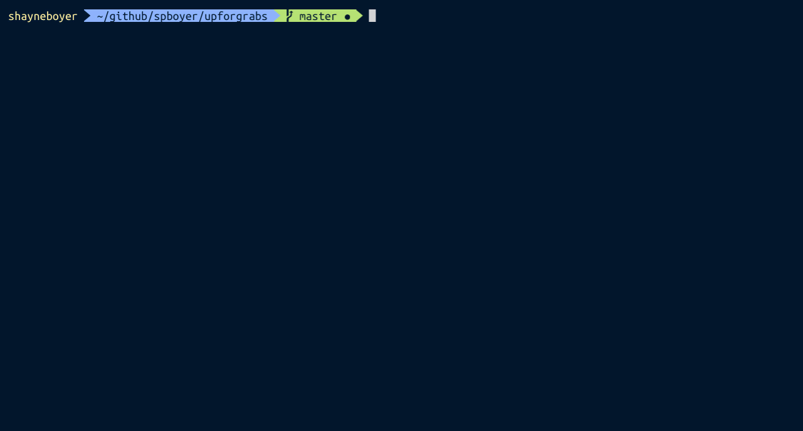
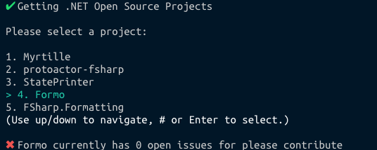
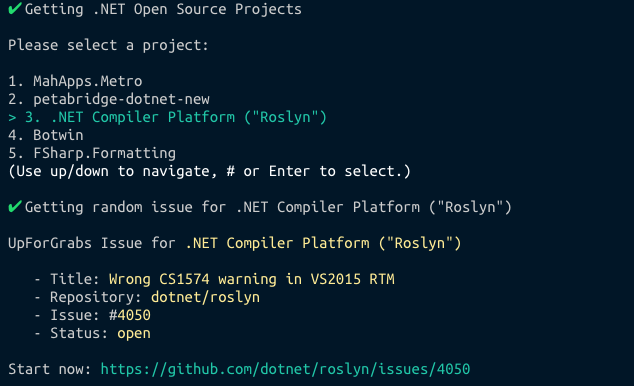

# dotnet-upforgrabs

Related blog: https://tattoocoder.com/finding-your-next-net-open-source-project-using-the-command-line/

Welcome to the .NET Core Global Tool to help you get started with contributing to Open Source projects.

Not sure what project needs help? Or where to start?

Install .NET Core 2.2 from https://dot.net and then install `upforgrabs`

```console
dotnet tool install -g upforgrabs
```

Open your favorite terminal and run.

```console
upforgrabs
```

`upforgrabs -h` for options.

```console
Usage: upforgrabs [arguments] [options]

Arguments:
  ProjectName

Options:
  -?|-h|--help           Show help information
  -o|--open              Auto open the selected issue
  -l|--lucky             Open first result
  -n|--number <RESULTS>  Number of results 1 - 25

```

Use the arrow keys to navigate the project selector and hit `<Enter>` or the cooresponding `#` to choose the project.



If there are no current items open in the selected project, you will be presented with a message similar to this.



otherwise a random issue is presented. Most terminals allow for clicking via CMD+Click or Ctrl+Click to open the URL. Or you may copy paste into a browser to get started.



Enjoy! And go contribute!